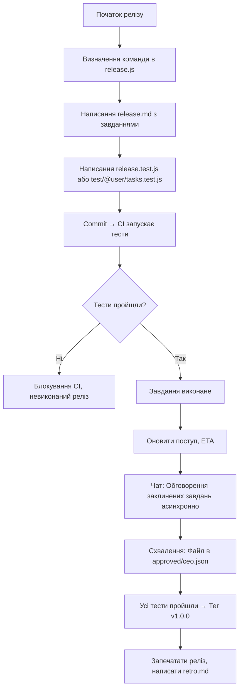

# 🤙 `system.md` — специфікація проєкту `@nan0web/release`

<blockquote style="padding: 2rem 1rem; background-image: linear-gradient(33deg, #00f6, #ff03)">
<ul>
<li>Прогрес — це пройдені тести.</li>
<li>Правда знаходиться в Git.</li>
<li>Ідентичність підтверджена підписом.</li>
<li>Дисципліна — це любов.</li>
</ul>
</blockquote>

Це канонічна специфікація для **`nan0web/release`**:  
Лаконічна, орієнтована на тести, система управління проєктами, створена для Git.

Створена для розумних команд, які цінують **правду, чіткість і завершеність**.

---

## 🎯 Ціль

Замінити припущення в управлінні проєктами на **виконувану правду**.

Визначати кожне завдання, команду та схвалення в коді — а потім дозволити тестам і підписам **підтвердити прогрес**.

Без нарад. Без оновлень. Без слів.

Лише те, що пройшло, що підписано і що закомічено.

---

## 🧘‍♂️ Філософія

1. **Лаконічність > Складність**  
   Мінімальна структура. Максимальна чіткість.

2. **Код > Завдання**  
   Завдання живуть в Git. Якщо не протестовано — не виконано.

3. **Прогрес через тести**  
   Статус завдання = результат тесту. Ніяких ручних оновлень.

4. **Асинхронна комунікація**  
   Чат є архівним. Виживають лише рішення.

5. **Робота офлайн, працюємо з Git**  
   Працюємо без інтернету. Випускаємо з інтегритетом.

6. **Ідентичність доведена**  
   Ти — той, за кого ти підписуєшся — не той, ким ти себе називаєш.

7. **Команда – це клас**  
   Ролі, контакти, очікування — все визначено в коді.

8. **Ти — те, що ти випускаєш**  
   Твій результат — це твоя репутація. Git це доводить.

> _"Будь правдивим. Роби. Вчись. Повторюй."_

---

## 📁 Структура даних

```
releases/
  1/
    0/
      v1.0.0/                           ← Корінь релізу
        release.md                      ← Нотатки до релізу (завдання, розділи)
        release.js                      ← Команда, ролі, конфігурація (клас Release)
        release.test.js                 ← Набір тестів (вхідна точка CI)
        test/
          {username}/                   ← Опціональний простір
            tasks.test.js               ← Користувацькі тести
        chat/                           ← Обговорення релізу
          2025/08/18/
            162000420.{username}.md     ← Повідомлення (часова мітка + користувач)
        task/
          ux.logo/                      ← Завдання за slug
            config.json                 ← { assignee, priority, dependsOn }
            approved/
              ceo.json                  ← Запис схвалення (GPG-підписаний)
            chat/
              2025/08/18/
                162000420.{username}.md ← Повідомлення по конкретному завданню
        assets/                         ← Дизайни, документи, результати
        retro.md                        ← Фінальне спостереження (запечатаний)
        .cache/                         ← gitignored: стан читання, сесія

.recover/{username}/                    ← Оголошення втрати ключа
.well-known/keys.json                   ← Реєстр публічних ключів
.nanorc.js                              ← Конфігурація проєкту (необов'язкова)
```

> ✅ Усі дані під контролем версій, перевіряються, повторювані.

---

## 🔄 Робочий процес



Основні правила:

- Немає завдання "виконане" доки тесту не пройшов
- Немає випуску без тегу
- Немає схвалення без `.json` файлу і підтвердженням ідентичності

---

## 🔐 Ідентичність та GPG Підпис

### 🔑 Чому GPG?

GPG дає **криптографічне підтвердження** того, хто зробив коміт чи схвалення.

Це не опціонально.  
Це **основа довіри**.

### ✅ Налаштування GPG Ключа (в кожному repo)

1. **Генерація GPG ключа**

   ```bash
   gpg --full-generate-key
   ```

   - Type: `1` (RSA and RSA)
   - Size: `4096`
   - Expires: `0` (ніколи)
   - Name: `UserName`
   - Email: `email@example.com`

2. **Перегляд ключів**

   ```bash
   gpg --list-secret-keys --keyid-format=long
   ```

   Отримаємо:

   ```
   sec   rsa4096/ABC123456789 2025-01-01 [SC]
         Key fingerprint = 123A 456B 789C ...
   uid                 [ultimate] UserName <email@example.com>
   ```

3. **Налаштування Git (в кожному repo)**

   ```bash
   cd /path/to/your/repo

   git config user.name "UserName"
   git config user.email "email@example.com"
   git config user.signingkey ABC123456789
   git config commit.gpgsign true
   ```

4. **Тест коміту з підписом**

   ```bash
   git commit -S -m "First signed commit"
   ```

   > Вас попросять passphrase.

5. **Перевірка підпису**
   ```bash
   git log --show-signature -1
   ```
   Перевірити:
   ```
   gpg: Good signature from "UserName <email@example.com>"
   ```

> ❗ Ніколи не використовуйте `--global` для `user.signingkey` або `commit.gpgsign`  
> Ідентичність залежить від **контексту** — одне repo, одна роль, один ключ.

---

## 🔄 Втрата ключа: Відновлення ідентичності

**Ви не можете відновити втрачений приватний ключ.**  
Але ви можете довести перехід.

### 3-крокова процедура відновлення

#### 1. **Написати декларацію переходу (якщо можливо)**

Якщо ще маєте доступ до старого ключа, підпишіть:

```text
Я, UserName <email@example.com>, володів GPG ключем: ABC123456789
Станом на 2025-08-20, я втратив доступ до нього.
Мій новий ключ: DEF987654321
Підписано: [GPG clearsign цього повідомлення зі старим ключем]
```

Записується як:

```
.recover/username/rotation-2025-08-20.md
```

#### 2. **Оновлення ідентичності в проєкті**

```js
// releases/1/0/v1.0.0.js
class Members {
	static UserName = new Person({
		name: "UserName",
		contacts: [new Contact("https://example.com")],
		gpgKey: "DEF987654321", // новий ключ
		revokedKey: "ABC123456789", // старий, втрачений ключ
	});
}
```

Або в `.well-known/keys.json`:

```json
{
	"user": "ya.raslove",
	"currentKey": "DEF987654321",
	"revokedKeys": [
		{
			"key": "ABC123456789",
			"revokedAt": "2025-08-20",
			"proof": "/recovery/ya.raslove/rotation-2025-08-20.md"
		}
	]
}
```

#### 3. **CI валідує перехід**

На першому коміті з новим ключем:

- CI перевіряє валідність ключа
- Шукає доказ переходу
- Блокує, якщо ключ непідписаний або без пояснення

---

## 🛠 CLI Команди

| Команда                                            | Опис                       |
| -------------------------------------------------- | -------------------------- |
| `nan0release`                                      | Показ статуса релізу       |
| `nan0release v1.0.0`                               | Показ конкретного релізу   |
| `nan0release ls`                                   | Список релізів              |
| `nan0release todo`                                 | Список моїх завдань        |
| `nan0release todo > todo.md`                       | Експорт завдань            |
| `nan0release chat write "msg"`                     | Написати у загальний чат   |
| `nan0release chat write ux.logo "help needed"`    | Написати у конкретний чат |
| `nan0release validate`                             | Перевірити структуру, тести, GPG |
| `nan0release serve`                                | Запустити локальний сервер |
| `nan0release host --webui`                         | Хостити онлайн з автентифікацією |
| `nan0release init v1.0.0`                          | Створити новий реліз       |
| `nan0release seal v1.0.0`                          | Зробити реліз незмінним    |

> Усі команди працюють з CI. Вивід через `--json`, `--quiet`.

---

## 🧪 Життєвий цикл завдання

| Стан               | Як реалізовано                          |
| ------------------ | ---------------------------------------- |
| `todo`             | Тест визначено через `it.todo()`         |
| `in-progress`      | Тест написано, але не пройшов            |
| `done`             | Тест пройдено, жодних ручних оновлень    |
| `blocked`          | Залежить від іншого завдання/схвалення   |
| `skipped`          | `it.skip()` — рідко використовується    |

Статус є **виводимий**, ніколи не написаний.

---

## ✅ Система схвалення

Схвалення — це **GPG-підписані JSON файли**:

```
task/ux.logo/approved/ceo.json
```

```json
{
	"by": "UserName <email@example.com>",
	"sign": "gpg:DEF987654321",
	"time": "2025-08-20T12:00:00Z"
}
```

Тестування:

```js
it("CEO approved logo", () => {
	expect(fileExists("task/ux.logo/approved/ceo.json")).toBe(true);
});
```

Дозволяється кілька схвалень:

- `ceo.json`, `cfo.json`, `legal.json`

CI перевіряє наявність файлу — **ви доводите це**.

---

## 🔒 Валідація на коміт

Git hook (через `husky` або `simple-git-hooks`) запускає:

```bash
nan0release validate
```

Помилка, якщо:

- Завдання згадано, але немає тестів
- Виконавець не існує в `release.js`
- Відсутній GPG підпис на важливому коміті
- Ключ — не поточний
- Спроба редагування пройденого завдання

Блокує `git commit` до виправлення.

> Правда підтверджена в джерелах.

---

## 🌐 Хостинг та інтерфейс

### `nan0release serve`

- Запускає локальний сервер
- Подає WebUI (`@nan0web/release-ui-lit`)
- Індекс у пам’яті для пошуку
- Без автентифікації (лише локально)

### `nan0release host --webui`

- Хостується онлайн
- Вимагає GPG автентифікації (через challenge-response)
- Синхронує `.cache` з Redis (необов’язково)
- WebSockets для миттєвих оновлень

> UI = ті ж дані, що й CLI. Лише візуалізація.

---

## 🧩 `.nan0rc.js` (Необов’язково)

```js
// .nanorc.js
export default {
	git: {
		user: "UserName",
		email: "email@example.com",
		signingKey: "ABC123456789",
		gpgsign: true,
	},
	hooks: {
		"on-release-done": "git tag v1.0.0",
		"on-task-fail": "echo @pm: task failure",
	},
};
```

Використовується:

```bash
nan0release init --trust-config
```

---

## Формат нотаток релізу

- `h1` - версія і дата релізу `# vX.Y.Z - YYYY-MM-DD`
- `h2` - розділ релізу
- `h3` - заголовок завдання з його описом

---

## 📜 Остаточна правда

> **Проєкт не той, який ви сказали.**  
> **Він той, який тести пройшли.**  
> **Він той, який коміти що демонструють.**  
> **Він той, який підписи підтверджують.**

`nan0web/release` — це не інструмент.  
Це **система дисципліни** для тих, хто шукає майстерності.

Починайте з малого.  
Будьте правдивими.  
Робіть релізи.
