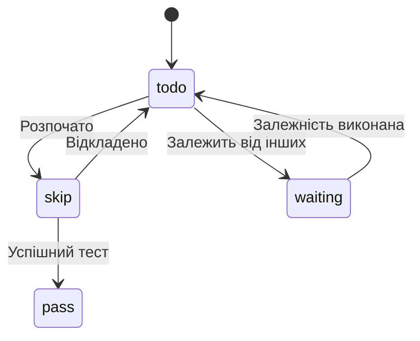
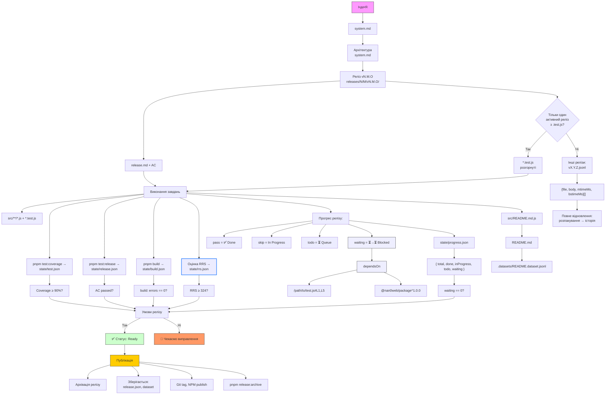

# 🤙 `system.md` — `@nan0web/release`  
## **Специфікація Проєкту**

<blockquote style="padding: 2rem 1rem; background: linear-gradient(45deg, #f006 0%, #f006 80%, #0003 81%, #0003 100%)">
<ul style="margin: 0; padding-left: 1.2rem">
<li>Прогрес — це пройдені тести.</li>
<li>Істина — у Git.</li>
<li>Особистість — підписана.</li>
<li>Дисципліна — це любов.</li>
</ul>
</blockquote>

Це — канонічна специфікація для **`nan0web/release`**:  
стисла, керована тестами, Git-нативна система для **Управління Проєктами Як Кодом (Project Management as Code)**.  
Створена для розумних команд, які шанують **істину, чіткість, завершення**.

---

## 🎯 Мета

Створення екосистеми `@nan0web/*` для керування проєктами як кодом (Project Management as Code).  
Замінити домисли щодо прогресу — на **виконувану істину**.

Кожне завдання, участь, схвалення — визначай у коді.  
Тести і цифрові підписи **доводять**, що було зроблено.

❌ Немає нарад.  
❌ Немає «оновлень».  
❌ Немає брехні.

✅ Лише те, що **пройшло**, **підписане**, **закомічене**.

---

## 🧘‍♂️ Філософія

- **Стислість > Складність**  
  Мінімум структури. Максимум ясності.

- **Код > Тікети**  
  Завдання живуть у Git.  
  Якщо немає тесту — це не «зроблено».

- **Прогрес, керований тестами**  
  Стан завдання = стан тесту.  
  Немає ручних оновлень.

- **Асинхронна комунікація**  
  Чат — тільки архів.  
  Виживають лише **рішення, підписані GPG**.

- **Офлайн-першість, Git-нативність**  
  Працюй без інтернету.  
  Публікуй із чистотою.

- **Особистість — це доведене**  
  тИ — це підпис. Не те, що тИ кажеш, а те, що підтверджено.

- **Команда — це клас**  
  Ролі, контакти, сподівання — описані в коді.  
  `class Members extends Team`.

- **тИ — це те, що тИ випускаєш**  
  Твій вихід — твоя репутація.  
  Git це доводить.

---

##  🧙 Ключові концепції

### 1. Система оцінки (RRS)
Кожен пакет/проєкт має **Release Readiness Score**:
```javascript
// tools/rrs.js
const RRS = {
  required: {       // Макс 400
    systemMd: 100,  // Наявність system.md
    testPass: 100,  // pnpm test → OK
    buildPass: 100, // pnpm build → OK
    tsconfig: 100   // Наявність tsconfig.json
  },
  optional: {       // Макс 24
    readmeTest: 10, // src/README.md.js
    playground: 10, // Демо-сторінки
    releaseMd: 1,   // releases/1/0/v1.0.0/release.md
		readmeMd: 1,    // `README.md` існує
    npmPublished: 1 // npm info <name> → версія
		contributingAndLicense: 1 // `CONTRIBUTING.md`, `LICENSE` існують
  }
}
```
**Градація:**  
-  🔴 < 300 — Нестабільний - тільки для розробників  
-  🟡 ≥ 300 — Готовий до використання
-  🟢 ≥ 324 — Готовий і перевірений

> 💡 Максимум: **324 бали**

---

### 2. PM as Code (ядро)
**Файлова структура пакету:**
```text
@nan0web/release/
├── releases/
│   └── 1/0/v1.0.0/
│       ├── release.md       ← Нотатки
│       ├── release.js       ← Конфіг (клас Release)
│       └── release.test.js  ← Тести
├── src/
│   ├── index.js
│   └── README.md.js         ← Автодокументація
└── system.md                ← Локальна специфікація
```

**Стани завдань:**


### 3. 📊 Стан прогресу

| Статус | Значення | Вплив |
|-------|----------|------|
| `pass` | ✅ Готово | Враховується в `done` |
| `skip` | 🚧 В роботі | `inProgress` |
| `todo` | ⏳ Окреме, готове до роботи | `todo` |
| `waiting` | ⏳→⏳ Чекає на інші тести | `waiting`, не блокує `todo` інших |

> `nan0release progress` → виводить:

```json
{
  "total": 20,
  "done": 5,
  "inProgress": 3,
  "todo": 7,
  "waiting": 5
}
```

> `waiting` не знижує довіру, але показує залежність.


### 4. Вимоги до релізу

Щоб отримати статус **`✅ Готово`**, потрібно:

| Критерій | Джерело | Обов’язковий |
|--------|--------|------------|
| Збірка проходить (`0 помилок`) | `pnpm build` → `state/build.json` | ✅ Так |
| Покриття тестами ≥ 90% | `test:coverage` → `state/test.json` | ✅ Так |
| Приймальні тести пройдені | `test:release` → `state/release.json` | ✅ Так |
| Документація структурно еквівалентна | `test/docs/structure.test.js` | ✅ Так |
| Прогрес відстежується | `state/progress.json` → `{done, total}` | ✅ Так |

### 5. Діаграма процесу розробки



---

## 📁 Структура даних

```
releases/
  1/
    0/
      v1.0.0/                           ← Корінь релізу
        release.md                      ← Нотатки (завдання, розділи)
        release.js                      ← Команда, ролі, конфіг (class Release)
        release.test.js                 ← Головний набір тестів (вхід для CI)
        test/
          {username}/
            tasks.test.js               ← Особисті тести
        chat/
          2025/08/18/
            162000420.{username}.md     ← Повідомлення
        task/
          ux.logo/
            config.json                 ← { assignee, priority, dependsOn }
            approved/
              ceo.json                  ← Схвалення (GPG-підписано)
            chat/
              2025/08/18/
                162000420.{username}.md ← Обговорення
        assets/                         ← Дизайн, документи, продукти
        retro.md                        ← Рефлексія (запечатано!)
        .cache/                         ← Не у Git: стан, сесія
```

```
.recover/{username}/                    ← Втрата ключа
.well-known/keys.json                   ← Реєстр публічних ключів
.nanorc.js                              ← Глобальний конфіг (опціонально)
```

---

### 🧩 Основні правила:

- Завдання «зроблено» = **тест** (`pass`)
- Реліз завершено = **є тег**
- Схвалення = **файл `.json` + GPG-підпис**

---

## Мінімальна структура пакета `@nan0web/*`

> Це — **канон**, який **всі наступні пакети** повинні дотримуватися.

```text
@nan0web/packages/*/
├─ .datasets/                    ← Датасети LLM (опціонально)
├─ playground/                   ← Жива демонстрація (опціонально)
├─ releases/                     ← PM як код (обов’язково)
│  └─ 1/0/v1.0.0/
│     ├─ release.md
│     ├─ release.js
│     └─ release.test.js
├─ src/
│  ├─ index.js
│  └─ README.md.js          ← Тест, що генерує README.md
├─ .editorconfig
├─ CONTRIBUTING.md
├─ LICENSE
├─ package.json
├─ README.md
├─ system.md                     ← ✅ Головна специфікація
├─ tsconfig.json                 ← ✅ Стандарт типів (для інших)
└─ pnpm-workspace.yaml           ← (якщо в монорепозиторії)
```

---

## 🔐 Особистість та GPG-підпис

### Навіщо GPG?

GPG — це не просто шифрування.  
Це **захист істини**.

- Хто написав коміт?
- Хто схвалив завдання?
- Хто ще має доступ?

**Якщо немає підпису — нічого не існує.**

---

### ✅ Налаштування GPG ключа

**1. Згенеруй ключ**

```bash
gpg --full-generate-key
```
- Тип: `1` (RSA и RSA)
- Розмір: `4096`
- Термін: `0` (назавжди)
- Ім’я: `ТвоєІм’я`
- Email: `email@example.com`

**2. Знайди ключ**

```bash
gpg --list-secret-keys --keyid-format=long
```

Вивід:
```
sec   rsa4096/ABC123456789 2025-01-01 [SC]
      Відбиток = 123A 456B 789C ...
uid                 [ultimate] ТвоєІм’я <email@example.com>
```

**3. Налаштуй Git**

```bash
cd /шлях/до/проєкту
git config user.name "ТвоєІм’я"
git config user.email "email@example.com"
git config user.signingkey ABC123456789
git config commit.gpgsign true
```

**4. Перевір підписання**

```bash
git commit -S -m "Перший підписаний коміт"
```

> Потрібен пароль-фраза.

**5. Перевір підпис**

```bash
git log --show-signature -1
```

Шукай:
```
gpg: Good signature from "ТвоєІм’я <email@example.com>"
```

---

## 🔄 Втрата ключа: відновлення особистості

**Приватний ключ втрачено назавжди**.  
Але можна **довести зміну ідентичності**.

### 🪄 3-кроковий протокол відновлення

**1. Напиши оголошення про зміну (якщо ще є доступ)**

Підпиши вихідним ключем:

```
Я, ТвоєІм’я <email@example.com>, володів ключем GPG: ABC123456789
З 2025-08-20 доступ втрачено.
Новий ключ: DEF987654321
Підписано: [GPG-підпис цього повідомлення старим ключем]
```

Збережи як:
```
.recover/твоєім’я/rotation-2025-08-20.md
```

**2. Онови особистість у проєкті**

У `releases/1/0/v1.0.0.js`:
```js
class Members {
	static ТвоєІм’я = new Person({
		name: "ТвоєІм’я",
		contacts: [new Contact("https://example.com")],
		gpgKey: "DEF987654321", // новий
		revokedKey: "ABC123456789", // старий
	});
}
```

Або у `.well-known/keys.json`:
```json
{
	"user": "твоєім’я",
	"currentKey": "DEF987654321",
	"revokedKeys": [
		{
			"key": "ABC123456789",
			"revokedAt": "2025-08-20",
			"proof": "/recover/твоєім’я/rotation-2025-08-20.md"
		}
	]
}
```

**3. CI перевіряє зміну**

- Шукає доведення (`/recover/`)
- Блокує коміти з непоясненими ключами

---

## 🛠 CLI команди

| Команда | Призначення |
|--------|------------|
| `nan0release` | Показати стан поточного релізу |
| `nan0release v1.0.0` | Стан певного релізу |
| `nan0release ls` | Перелік усіх релізів |
| `nan0release todo` | Мої невиконані завдання |
| `nan0release todo > todo.md` | Експорт завдань |
| `nan0release chat write "повідомлення"` | Чат релізу |
| `nan0release chat write ux.logo "допомога"` | Обговорення задачі |
| `nan0release validate` | Перевірити структуру, тести, GPG |
| `nan0release serve` | Запустити локальний WebUI |
| `nan0release host --webui` | Захостити онлайн з GPG-авторизацією |
| `nan0release init v1.0.0` | Створити реліз |
| `nan0release seal v1.0.0` | Зробити реліз незмінним |

---

## 🧪 Життєвий цикл завдання

| Стан | Як досягти |
|------|------------|
| `todo` | `it.todo()` — завдання визначене |
| `skipped` або<br>`progress` | `it.skip()` - задача вибрана людиною і в процесі виконання |
| `done` | `it()` → `pass` — автоматично завершено |
|
| `blocked` | Залежить від іншого завдання/схвалення |

> Стан **виводиться автоматично**.  
> **Жодного ручного введення.**

---

## ✅ Система схвалень

Схвалення — це **GPG-підписані JSON-файли**:

`task/ux.logo/approved/ceo.json`:
```json
{
	"by": "ТвоєІм’я <email@example.com>",
	"sign": "gpg:DEF987654321",
	"time": "2025-08-20T12:00:00Z"
}
```

Тест:
```js
it("CEO схвалив логотип", () => {
	expect(fileExists("task/ux.logo/approved/ceo.json")).toBe(true);
});
```

Багаторазові схвалення:
- `ceo.json`, `cfo.json`, `legal.json` — усі підписані

> CI перевіряє: **файл існує і підписаний**.  
> Ти — **доводиш факт**.

---

## 🔒 Перевірка при коміті

Гіт-гук (`husky` / `simple-git-hooks`) запускає:

```bash
nan0release validate
```

**Блокує `git commit`, якщо**:
- Завдання є, а тесту немає
- Виконавець відсутній у `release.js`
- Немає GPG-підпису для важливого коміту
- Використано застарілий або невідомий ключ
- Спроба змінити вміст пройденого завдання

---

## 🌐 Хостинг та WebUI

### `nan0release serve`
- Запускає локальний сервер
- Подає WebUI (`@nan0web/release-ui-lit`)
- Пошук у пам’яті
- Без авторизації (лише локально)

### `nan0release host --webui`
- Хостить у мережі
- Авторизація через GPG (challenge-response)
- `.cache` синхронізується через Redis (опціонально)
- WebSockets для живих оновлень

---

## 🧩 `.nanorc.js` (опціонально)

```js
// .nanorc.js
export default {
	git: {
		user: "ТвоєІм’я",
		email: "email@example.com",
		signingKey: "ABC123456789",
		gpgsign: true,
	},
	hooks: {
		"on-release-done": "git tag v1.0.0",
		"on-task-fail": "echo @pm: failure"
	},
};
```

Використовується при:
```bash
nan0release init --trust-config
```

---

## 📜 Остаточна Істина

> **`@nan0web/release` — це не про інструменти.**  
> **Це — про дисципліну. Про довіру. Про завершення.**

Це система для тих, хто прагне **майстерності**.

🫶 Почни з малого.  
🫶 Залишайся істинним.  
🚀 **Публікуй завершене.**

