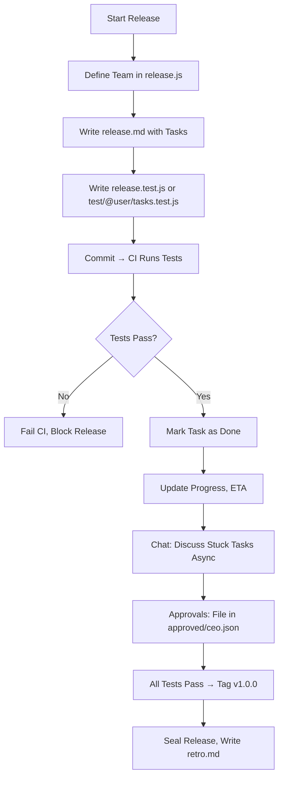

# 🤙 `system.md` — `@nan0web/release` Project Specification

<blockquote style="padding: 2rem 1rem; background-image: linear-gradient(33deg, #00f6, #ff03)">
<ul>
<li>Progress is passing tests.</li>
<li>Truth is in Git.</li>
<li>Identity is signed.</li>
<li>Discipline is love.</li>
</ul>
</blockquote>

This is the canonical specification for **`nan0web/release`**:  
A laconic, test-driven, Git-native system for **Project Management as Code**.

Built for intelligent teams who value **truth, clarity, and completion**.

---

## 🎯 Goal

Replace speculative project management with **executable truth**.

Define every task, team, and approval in code — then let tests and signatures **prove progress**.

No meetings. No updates. No lies.

Only what passes, what’s signed, and what’s committed.

---

## 🧘‍♂️ Philosophy

1. **Laconic > Complex**  
   Minimum structure. Maximum clarity.

2. **Code > Tickets**  
   Tasks live in Git. If it’s not tested, it’s not done.

3. **Test-Driven Progress**  
   Task status = test result. No manual updates.

4. **Asynchronous Communication**  
   Chat is archival. Only decisions survive.

5. **Offline-First, Git-Native**  
   Work without internet. Ship with integrity.

6. **Identity is Provable**  
   You are who you sign as — not who you claim.

7. **Team is a Class**  
   Roles, contacts, expectations — defined in code.

8. **You Are What You Ship**  
   Your output is your reputation. Git proves it.

> _"Be truthful. Deliver. Learn. Repeat."_

---

## 📁 Data Structure

```
releases/
  1/
    0/
      v1.0.0/                           ← Release root
        release.md                      ← Release notes (tasks, sections)
        release.js                      ← Team, roles, config (class Release)
        release.test.js                 ← Main test suite (CI entrypoint)
        test/
          {username}/                   ← Optional scope
            tasks.test.js               ← User-specific tests
        chat/                           ← Release-wide chat
          2025/08/18/
            162000420.{username}.md     ← Message (timestamp + user)
        task/
          ux.logo/                      ← Task by slug
            config.json                 ← { assignee, priority, dependsOn }
            approved/
              ceo.json                  ← Approval record (GPG-signed)
            chat/
              2025/08/18/
                162000420.{username}.md ← Task-specific message
        assets/                         ← Designs, docs, deliverables
        retro.md                        ← Final reflection (sealed)
        .cache/                         ← gitignored: read state, session

.recover/{username}/                    ← Key loss declarations
.well-known/keys.json                   ← Public key registry
.nanorc.js                              ← Project config (optional)
```

> ✅ All data is version-controlled, auditable, reproducible.

---

## 🔄 Workflow



Key rules:

- No task is "done" unless test passes
- No release is complete without tag
- No approval without `.json` file and identity proof

---

## 🔐 Identity & GPG Signing

### 🔑 Why GPG?

GPG provides **cryptographic proof** of who made a commit or approval.

This is not optional.  
It is the **foundation of trust**.

### ✅ Setup GPG Key (Per Repo)

1. **Generate GPG Key**

   ```bash
   gpg --full-generate-key
   ```

   - Type: `1` (RSA and RSA)
   - Size: `4096`
   - Expires: `0` (never)
   - Name: `UserName`
   - Email: `email@example.com`

2. **List Your Key**

   ```bash
   gpg --list-secret-keys --keyid-format=long
   ```

   Output:

   ```
   sec   rsa4096/ABC123456789 2025-01-01 [SC]
         Key fingerprint = 123A 456B 789C ...
   uid                 [ultimate] UserName <email@example.com>
   ```

3. **Configure Git (Per Repo)**

   ```bash
   cd /path/to/your/repo

   git config user.name "UserName"
   git config user.email "email@example.com"
   git config user.signingkey ABC123456789
   git config commit.gpgsign true
   ```

4. **Test Signed Commit**

   ```bash
   git commit -S -m "First signed commit"
   ```

   > You’ll be prompted for passphrase.

5. **Verify Signature**
   ```bash
   git log --show-signature -1
   ```
   Look for:
   ```
   gpg: Good signature from "UserName <email@example.com>"
   ```

> ❗ Never use `--global` for `user.signingkey` or `commit.gpgsign`  
> Identity depends on **context** — one repo, one role, one key.

---

## 🔄 Key Loss: Identity Recovery

**You cannot recover a lost private key.**  
But you can prove a transition.

### 3-Step Recovery Protocol

#### 1. **Write Transition Declaration (If Possible)**

If you still have access to old key, sign this:

```text
I, UserName <email@example.com>, owned GPG key: ABC123456789
As of 2025-08-20, I have lost access to it.
My new key is: DEF987654321
Signed: [GPG clearsign of this message with old key]
```

Save as:

```
.recover/username/rotation-2025-08-20.md
```

#### 2. **Update Identity in Project**

```js
// releases/1/0/v1.0.0.js
class Members {
	static UserName = new Person({
		name: "UserName",
		contacts: [new Contact("https://example.com")],
		gpgKey: "DEF987654321", // new key
		revokedKey: "ABC123456789", // old, lost key
	});
}
```

Or in `.well-known/keys.json`:

```json
{
	"user": "ya.raslove",
	"currentKey": "DEF987654321",
	"revokedKeys": [
		{
			"key": "ABC123456789",
			"revokedAt": "2025-08-20",
			"proof": "/recovery/ya.raslove/rotation-2025-08-20.md"
		}
	]
}
```

#### 3. **CI Validates Transition**

On first commit with new key:

- CI checks if key is current
- Looks for rotation proof
- Blocks if unsigned or unexplained

---

## 🛠 CLI Commands

| Command                                        | Description                 |
| ---------------------------------------------- | --------------------------- |
| `nan0release`                                  | Show current release status |
| `nan0release v1.0.0`                           | Show specific release       |
| `nan0release ls`                               | List all releases           |
| `nan0release todo`                             | Show my assigned tasks      |
| `nan0release todo > todo.md`                   | Export tasks                |
| `nan0release chat write "msg"`                 | Write release chat          |
| `nan0release chat write ux.logo "help needed"` | Write task chat             |
| `nan0release validate`                         | Check structure, tests, GPG |
| `nan0release serve`                            | Start local WebUI (no auth) |
| `nan0release host --webui`                     | Host online with GPG auth   |
| `nan0release init v1.0.0`                      | Scaffold new release        |
| `nan0release seal v1.0.0`                      | Make release immutable      |

> All commands are CI-friendly. Output via `--json`, `--quiet`.

---

## 🧪 Task Lifecycle

| State         | How                            |
| ------------- | ------------------------------ |
| `todo`        | Test defined with `it.todo()`  |
| `in-progress` | Test written, not passing      |
| `done`        | Test passes, no manual update  |
| `blocked`     | Depends on other task/approval |
| `skipped`     | `it.skip()` — use sparingly    |

Status is **inferred**, never written.

---

## ✅ Approval System

Approvals are **GPG-signed JSON files**:

```
task/ux.logo/approved/ceo.json
```

```json
{
	"by": "UserName <email@example.com>",
	"sign": "gpg:DEF987654321",
	"time": "2025-08-20T12:00:00Z"
}
```

Test:

```js
it("CEO approved logo", () => {
	expect(fileExists("task/ux.logo/approved/ceo.json")).toBe(true);
});
```

Multiple approvals allowed:

- `ceo.json`, `cfo.json`, `legal.json`

CI verifies file exists — **you prove it**.

---

## 🔒 Validation on Commit

Git hook (via `husky` or `simple-git-hooks`) runs:

```bash
nan0release validate
```

Fails if:

- Task referenced but test missing
- Assignee doesn’t exist in `release.js`
- GPG signature missing on critical commit
- Key used is not current
- Attempt to edit passed task content

Blocks `git commit` until fixed.

> Truth is enforced at source.

---

## 🌐 Hosting & UI

### `nan0release serve`

- Starts local server
- Serves WebUI (`@nan0web/release-ui-lit`)
- In-memory index for search
- No auth (local only)

### `nan0release host --webui`

- Hosts online
- Requires GPG sign-in (challenge-response)
- Syncs `.cache` via Redis (optional)
- WebSockets for live updates

> UI = same data as CLI. Just visual.

---

## 🧩 `.nan0rc.js` (Optional)

```js
// .nanorc.js
export default {
	git: {
		user: "UserName",
		email: "email@example.com",
		signingKey: "ABC123456789",
		gpgsign: true,
	},
	hooks: {
		"on-release-done": "git tag v1.0.0",
		"on-task-fail": "echo @pm: task failure",
	},
};
```

Used by:

```bash
nan0release init --trust-config
```

---

## Release notes format

- `h1` - version and release (planned) date `# vX.Y.Z - YYYY-MM-DD`
- `h2` - release section
- `h3` - task title with its content

---

## 📜 Final Truth

> **A project is not what you say it is.**  
> **It’s what the tests pass.**  
> **It’s what the commits show.**  
> **It’s what the signatures prove.**

`nan0web/release` is not a tool.  
It’s a **discipline system** for those who seek mastery.

Start small.  
Stay truthful.  
Ship.
